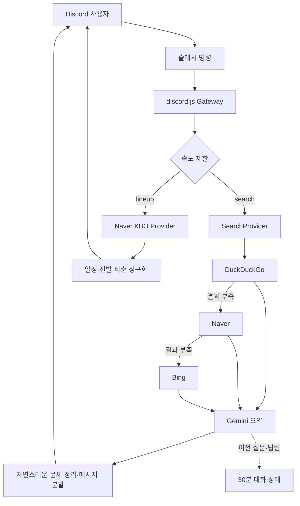

# Discord Web Search Bot


Discord 안에서 최신 웹 정보를 검색하고 사람이 직접 정리한 듯 자연스럽게 답변하는 봇입니다. 현재는 작고 안전한 검색 MVP에 집중하며, 기능이 늘어나도 핵심 로직을 교체하지 않고 모듈을 추가할 수 있도록 구성했습니다.

## 현재 기능

- `/search query:<질문>`: DuckDuckGo → Naver → Bing 순서로 결과를 채우고 Gemini가 자연스러운 문장으로 정리
- `/lineup query:<팀이름>`: 한국 시간 기준 오늘의 KBO 상대팀, 경기 시각·구장, 선발투수와 양 팀 타순 확인
- `/problem problem-id:<번호>`: 정올 문제 요약 정보와 원문 링크 확인
- `/tag query:<태그>`: 정올 태그별 문제 검색
- `/user handle:<이름>`: 정올 공개 유저 검색
- `/kboplayer`: KBO 선수 맞히기용 비밀 정답을 명령 사용자에게만 표시
- 선택한 채널에 KBO 플레이볼 및 김서현 등판 `44 ALERT` 역할 멘션
- `/reset`: 현재 사용자·채널의 30분 후속 대화 문맥 초기화
- `/ping`: Gateway 연결 상태 확인
- 검색 자료와 URL은 답변 생성에만 사용하고 Discord 메시지에는 노출하지 않음
- Discord 2,000자 제한에 맞춘 자동 분할
- 사용자별 기본 5회/분 속도 제한
- 불필요한 Message Content privileged intent 미사용
- Docker, Codespaces, GitHub Actions CI 기본 제공

## 기술 선택

| 영역 | 선택 | 이유 |
|---|---|---|
| 언어 | TypeScript (strict) | 기능 확장 시 인터페이스와 오류를 일찍 발견 |
| Discord | discord.js v14 | 슬래시 명령과 Gateway 생태계가 안정적 |
| 검색 수집 | 합성 공급자 + DuckDuckGo/Naver/Bing 엔진 | 한 엔진이 차단되거나 결과가 적어도 다음 엔진으로 자동 보충 |
| KBO 데이터 | Naver Sports 일정·preview·relay 수집기 | 경기 전 선발/타순과 경기 시작 후 확정 타순을 한 구조로 정규화 |
| Jungol 데이터 | 공개 HTML 요약 수집기 | 로그인·문제 본문 복제 없이 문제·태그·유저 링크 제공 |
| HTML 파싱 | JSDOM | 정규식 대신 실제 DOM 선택자로 검색 결과와 향후 사이트 데이터를 파싱 |
| 답변 생성 | Gemini REST API | 무료 티어 모델로 검색 결과를 간결하게 요약 |
| 상태 | 메모리 기반 이전 질문·답변 저장 | MVP에서 DB 없이 후속 질문 지원 |
| 검증 | Zod | 시작 시 환경 변수 오류를 명확히 표시 |
| 테스트 | Vitest | 순수 로직을 빠르게 단위 테스트 |

## 동작 구조



## 빠른 시작

요구 사항: Node.js 22 이상, Discord 애플리케이션, Google AI Studio의 Gemini API 키.

```bash
npm install
cp .env.example .env
```

`.env`에 값을 입력한 뒤 개발 서버에 명령을 등록합니다.

```bash
npm run invite:url
npm run commands:register
npm run dev
```

첫 번째 명령이 출력한 OAuth2 URL을 브라우저에서 열고 **서버에 추가**를 선택하세요. 일반 `discord.gg/...` 링크는 사람용 서버 초대 링크이므로 봇 설치에는 사용할 수 없습니다.

Discord Developer Portal에서 앱을 만들고 특정 서버에 설치하는 정확한 순서는 [Discord 설정 가이드](docs/SETUP_DISCORD.md)를 확인하세요.

> `npm run dev` 또는 배포된 프로세스가 계속 실행 중이어야 봇이 온라인 상태를 유지합니다. Codespace가 중지되면 봇도 오프라인이 됩니다.

## 환경 변수

| 이름 | 필수 | 기본값 | 설명 |
|---|---:|---|---|
| `DISCORD_CLIENT_ID` | 예 | - | Discord Application ID |
| `DISCORD_TOKEN` | 예 | - | Discord Bot Token |
| `DISCORD_ALLOWED_GUILD_IDS` | 예 | - | 봇 사용을 허용할 서버 ID 목록. 쉼표로 구분 |
| `DISCORD_GUILD_ID` | 아니요 | 빈 값 | 이전 단일 서버 설정과의 호환용 ID |
| `GEMINI_API_KEY` | 예 | - | Google AI Studio에서 발급한 Gemini API 키 |
| `GEMINI_MODEL` | 아니요 | `gemini-3.1-flash-lite` | 검색 결과를 요약할 모델 |
| `SEARCH_TIMEOUT_MS` | 아니요 | `60000` | 각 외부 요청의 타임아웃 |
| `SEARCH_MAX_RESULTS` | 아니요 | `5` | Gemini에 전달할 검색 결과 수(최대 10) |
| `KBO_TIMEOUT_MS` | 아니요 | `10000` | 네이버 스포츠 요청 타임아웃 |
| `KBO_CACHE_SECONDS` | 아니요 | `30` | 같은 일정·라인업을 다시 요청하지 않는 메모리 캐시 시간 |
| `KBO_ALERT_CHANNEL_IDS` | 아니요 | 빈 값 | 플레이볼·44 ALERT를 전송할 채널 ID 목록 |
| `KBO_ALERT_ROLE_NAME` | 아니요 | `야구` | 알림에서 멘션할 역할의 정확한 이름 |
| `KBO_ALERT_ACTIVE_POLL_SECONDS` | 아니요 | `30` | 경기 시작 전·진행 중 확인 간격 |
| `KBO_ALERT_IDLE_POLL_SECONDS` | 아니요 | `300` | 그 외 시간 확인 간격 |
| `KBO_PLAYBALL_GRACE_MINUTES` | 아니요 | `15` | 시작 알림을 늦게라도 허용할 시간 |
| `JUNGOL_TIMEOUT_MS` | 아니요 | `10000` | Jungol 공개 페이지 요청 타임아웃 |
| `JUNGOL_CACHE_SECONDS` | 아니요 | `300` | 같은 Jungol 요청의 캐시 시간 |
| `CONVERSATION_TTL_MINUTES` | 아니요 | `30` | 후속 질문 문맥 보관 시간 |
| `RATE_LIMIT_REQUESTS` | 아니요 | `5` | 한 윈도우의 사용자별 요청 수 |
| `RATE_LIMIT_WINDOW_SECONDS` | 아니요 | `60` | 속도 제한 윈도우 |
| `MAX_RESPONSE_CHARS` | 아니요 | `10000` | 답변 전체 최대 길이 |

> 실제 `.env`는 절대 커밋하지 마세요. `.gitignore`에 이미 포함되어 있습니다.

## 화이트리스트 봇과 설치 범위

- `DISCORD_ALLOWED_GUILD_IDS`에 쉼표로 나열한 서버에만 명령을 등록하고 봇 기능을 허용합니다.
- 허용 서버가 하나도 없으면 실수로 공개 범위에서 실행되지 않도록 봇 시작이 중단됩니다.
- 다른 서버에 설치되더라도 봇은 시작 시점 또는 서버 추가 이벤트에서 즉시 그 서버를 나갑니다.
- 허용 서버의 다른 관리자도 설치할 수 있게 Developer Portal의 **Bot → Public Bot**을 켜고, `npm run invite:url`로 생성한 서버 고정 링크를 전달합니다.
- `Public Bot`이 켜져 있어도 화이트리스트 밖 서버에서는 기능이 차단되고 봇이 즉시 나갑니다.

명령 정의를 바꾼 뒤에는 `npm run commands:register`를 다시 실행해야 합니다.

```env
DISCORD_ALLOWED_GUILD_IDS=111111111111111111,222222222222222222
```

`/search` 답변은 기본적으로 채널에 공개되므로 같은 채널의 다른 사용자도 답변을 볼 수 있습니다. 검색에 사용한 URL과 출처 목록은 메시지에 표시하지 않습니다.
`/lineup`은 모바일에서도 원정팀과 홈팀 타순이 세로로 읽히도록 경기별 Discord 임베드 카드로 표시합니다.

## 품질 확인

```bash
npm run check
npm run build
```

Discord나 Gemini를 제외하고 현재 실행 환경의 검색 엔진만 점검하려면:

```bash
npm run search:smoke -- 류현진
```

성공하면 결과마다 `providerId`가 표시됩니다. 실패하면 `Search pipeline exhausted` 진단에서 어느 엔진이 차단되거나 빈 결과를 반환했는지 확인할 수 있습니다.

Discord에 연결하지 않고 오늘의 KBO 수집 결과를 확인하려면:

```bash
npm run kbo:smoke -- 한화
```

Jungol 공개 페이지 수집기를 점검하려면:

```bash
npm run jungol:smoke -- problem 1000
npm run jungol:smoke -- tag mst
npm run jungol:smoke -- user goodaiden
```

자세한 수집 범위와 부하 제한은 [Jungol 수집 정책](docs/JUNGOL.md)에 정리되어 있습니다.

경기 하루 전이나 경기 당일 이른 시간에는 네이버 스포츠에 전체 타순이 아직 올라오지 않아 선발투수만 표시될 수 있습니다. 전체 타순이 발표되면 같은 명령에서 자동으로 1~9번 타순을 표시합니다.

Docker로 실행하려면:

```bash
docker compose up --build -d
docker compose logs -f bot
```

## 프로젝트 구조

```text
src/
├── bot/          # Discord 명령, 이벤트, 응답 흐름
├── config/       # 환경 변수 검증
├── gemini/       # Gemini 답변 생성기
├── kbo/          # 팀명 정규화, Naver Sports 공급자, 일정·라인업 서비스
├── jungol/       # 공개 문제·태그·유저 페이지 수집기
├── lib/          # 로깅과 Discord 메시지 처리
├── scraping/     # 브라우저형 HTTP 클라이언트와 향후 사이트 스크래퍼 공통 계층
├── search/       # 합성 공급자와 검색 엔진
├── security/     # 사용자별 속도 제한
├── state/        # 짧은 후속 대화 문맥 보관
└── index.ts      # 의존성 조립과 프로세스 시작
scripts/          # Discord 명령 등록 스크립트
tests/            # 순수 로직 단위 테스트
docs/             # 설정, 아키텍처, 로드맵
```

## 다음 기능을 붙이는 순서

기능을 무작정 한 파일에 추가하지 말고 다음 경계를 유지합니다.

1. 새 Discord 명령은 `src/bot/commands.ts`에 정의
2. Jungol과 KBO 같은 사이트 기능은 일반 검색과 분리된 전용 공급자로 구현
3. 답변 모델을 바꿀 때는 `AnswerGenerator`를 구현
4. 영속 상태가 필요해지면 `ConversationStore`를 Redis/PostgreSQL 구현으로 교체
5. 사용자 수가 늘면 큐, 분산 속도 제한, 관측성을 차례로 추가

구체적인 확장 기준은 [아키텍처](docs/ARCHITECTURE.md)와 [로드맵](docs/ROADMAP.md)에 정리되어 있습니다.

## 공식 참고 자료

- [Gemini API 키 가이드](https://ai.google.dev/gemini-api/docs/api-key)
- [Gemini 텍스트 생성 가이드](https://ai.google.dev/gemini-api/docs/text-generation)
- [Discord Developer Portal](https://discord.com/developers/applications)
- [discord.js 가이드](https://guide.discordjs.dev/)

## 보안

취약점 신고와 토큰 유출 대응은 [SECURITY.md](SECURITY.md)를 확인하세요.

## 검색 공급자 주의사항

현재 웹 결과 수집은 `kannyan`의 브라우저형 HTML 검색과 DOM 파싱 방향을 채택하되, 한 공급자에 의존하지 않도록 DuckDuckGo, Naver, Bing 엔진을 합성합니다. 각 엔진은 JSDOM 파서와 진단 결과를 독립적으로 가지며 결과가 부족하면 다음 엔진이 보충합니다. HTML 응답 구조나 접근 정책이 바뀌면 해당 엔진만 교체할 수 있습니다. Gemini에는 실제 검색 결과를 내부 자료로 전달하지만, 생성된 답변에서는 출처 번호·URL·장식용 Markdown을 제거합니다.

KBO 기능은 네이버 스포츠 화면이 사용하는 비공식 JSON 게이트웨이를 읽습니다. 인증 정보나 쿠키 없이 공개 경기 정보만 요청하고, 기본 30초 캐시로 반복 호출을 줄입니다. 비공식 경로이므로 네이버의 응답 형식이 바뀌면 `KBO_INVALID_RESPONSE`가 발생할 수 있으며 fixture 테스트를 갱신해야 합니다.
