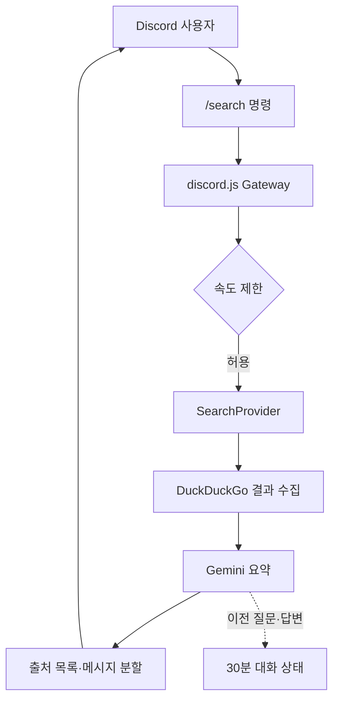

# Discord Web Search Bot


Discord 안에서 최신 웹 정보를 검색하고, 클릭 가능한 출처와 함께 답변하는 봇입니다. 현재는 작고 안전한 검색 MVP에 집중하며, 기능이 늘어나도 핵심 로직을 교체하지 않고 모듈을 추가할 수 있도록 구성했습니다.

## 현재 기능

- `/search query:<질문>`: DuckDuckGo에서 결과를 수집하고 Gemini가 출처 번호와 함께 요약
- `/reset`: 현재 사용자·채널의 30분 후속 대화 문맥 초기화
- `/ping`: Gateway 연결 상태 확인
- 검색에 실제 사용한 URL을 Discord에서 클릭 가능한 출처 목록으로 표시
- Discord 2,000자 제한에 맞춘 자동 분할
- 사용자별 기본 5회/분 속도 제한
- 불필요한 Message Content privileged intent 미사용
- Docker, Codespaces, GitHub Actions CI 기본 제공

## 기술 선택

| 영역 | 선택 | 이유 |
|---|---|---|
| 언어 | TypeScript (strict) | 기능 확장 시 인터페이스와 오류를 일찍 발견 |
| Discord | discord.js v14 | 슬래시 명령과 Gateway 생태계가 안정적 |
| 검색 수집 | `SearchProvider` + DuckDuckGo HTML | API 키 없이 검색하고 향후 Jungol 공급자를 독립적으로 추가 |
| 답변 생성 | Gemini REST API | 무료 티어 모델로 검색 결과를 간결하게 요약 |
| 상태 | 메모리 기반 이전 질문·답변 저장 | MVP에서 DB 없이 후속 질문 지원 |
| 검증 | Zod | 시작 시 환경 변수 오류를 명확히 표시 |
| 테스트 | Vitest | 순수 로직을 빠르게 단위 테스트 |

## 동작 구조



## 빠른 시작

요구 사항: Node.js 22 이상, Discord 애플리케이션, Google AI Studio의 Gemini API 키.

```bash
npm install
cp .env.example .env
```

`.env`에 값을 입력한 뒤 개발 서버에 명령을 등록합니다.

```bash
npm run invite:url
npm run commands:register
npm run dev
```

첫 번째 명령이 출력한 OAuth2 URL을 브라우저에서 열고 **서버에 추가**를 선택하세요. 일반 `discord.gg/...` 링크는 사람용 서버 초대 링크이므로 봇 설치에는 사용할 수 없습니다.

Discord Developer Portal에서 앱을 만들고 특정 서버에 설치하는 정확한 순서는 [Discord 설정 가이드](docs/SETUP_DISCORD.md)를 확인하세요.

> `npm run dev` 또는 배포된 프로세스가 계속 실행 중이어야 봇이 온라인 상태를 유지합니다. Codespace가 중지되면 봇도 오프라인이 됩니다.

## 환경 변수

| 이름 | 필수 | 기본값 | 설명 |
|---|---:|---|---|
| `DISCORD_CLIENT_ID` | 예 | - | Discord Application ID |
| `DISCORD_TOKEN` | 예 | - | Discord Bot Token |
| `DISCORD_GUILD_ID` | 아니요 | 빈 값 | 개발 서버 ID. 입력하면 명령이 즉시 반영됨 |
| `GEMINI_API_KEY` | 예 | - | Google AI Studio에서 발급한 Gemini API 키 |
| `GEMINI_MODEL` | 아니요 | `gemini-3.1-flash-lite` | 검색 결과를 요약할 모델 |
| `SEARCH_TIMEOUT_MS` | 아니요 | `60000` | 각 외부 요청의 타임아웃 |
| `SEARCH_MAX_RESULTS` | 아니요 | `5` | Gemini에 전달할 검색 결과 수(최대 10) |
| `CONVERSATION_TTL_MINUTES` | 아니요 | `30` | 후속 질문 문맥 보관 시간 |
| `RATE_LIMIT_REQUESTS` | 아니요 | `5` | 한 윈도우의 사용자별 요청 수 |
| `RATE_LIMIT_WINDOW_SECONDS` | 아니요 | `60` | 속도 제한 윈도우 |
| `MAX_RESPONSE_CHARS` | 아니요 | `10000` | 답변 전체 최대 길이 |

> 실제 `.env`는 절대 커밋하지 마세요. `.gitignore`에 이미 포함되어 있습니다.

## 명령 등록 범위

- `DISCORD_GUILD_ID`를 넣으면 한 개발 서버에 명령을 등록합니다. 변경이 빠르게 반영되어 개발 중 권장합니다.
- 비워 두면 전역 명령으로 등록합니다. 여러 서버에서 쓸 수 있지만 Discord 전파에 시간이 걸릴 수 있습니다.

명령 정의를 바꾼 뒤에는 `npm run commands:register`를 다시 실행해야 합니다.

`/search` 답변은 기본적으로 채널에 공개되므로 같은 채널의 다른 사용자도 검색 결과와 출처를 볼 수 있습니다.

## 품질 확인

```bash
npm run check
npm run build
```

Docker로 실행하려면:

```bash
docker compose up --build -d
docker compose logs -f bot
```

## 프로젝트 구조

```text
src/
├── bot/          # Discord 명령, 이벤트, 응답 흐름
├── config/       # 환경 변수 검증
├── gemini/       # Gemini 답변 생성기
├── lib/          # 로깅과 Discord 메시지 처리
├── search/       # 공급자 인터페이스, 웹 결과 수집, 출처 처리
├── security/     # 사용자별 속도 제한
├── state/        # 짧은 후속 대화 문맥 보관
└── index.ts      # 의존성 조립과 프로세스 시작
scripts/          # Discord 명령 등록 스크립트
tests/            # 순수 로직 단위 테스트
docs/             # 설정, 아키텍처, 로드맵
```

## 다음 기능을 붙이는 순서

기능을 무작정 한 파일에 추가하지 말고 다음 경계를 유지합니다.

1. 새 Discord 명령은 `src/bot/commands.ts`에 정의
2. 새 검색 대상은 `SearchProvider`를 구현 (`JungolSearchProvider` 등)
3. 답변 모델을 바꿀 때는 `AnswerGenerator`를 구현
4. 영속 상태가 필요해지면 `ConversationStore`를 Redis/PostgreSQL 구현으로 교체
5. 사용자 수가 늘면 큐, 분산 속도 제한, 관측성을 차례로 추가

구체적인 확장 기준은 [아키텍처](docs/ARCHITECTURE.md)와 [로드맵](docs/ROADMAP.md)에 정리되어 있습니다.

## 공식 참고 자료

- [Gemini API 키 가이드](https://ai.google.dev/gemini-api/docs/api-key)
- [Gemini 텍스트 생성 가이드](https://ai.google.dev/gemini-api/docs/text-generation)
- [Discord Developer Portal](https://discord.com/developers/applications)
- [discord.js 가이드](https://guide.discordjs.dev/)

## 보안

취약점 신고와 토큰 유출 대응은 [SECURITY.md](SECURITY.md)를 확인하세요.

## 검색 공급자 주의사항

현재 웹 결과 수집은 `kannyan` 저장소의 “외부 검색 결과와 LLM 요약을 분리”하는 접근을 참고해 DuckDuckGo HTML 엔드포인트를 사용합니다. 공식 유료 검색 API가 아니므로 응답 형식이나 접근 정책이 바뀌면 동작하지 않을 수 있습니다. 이 경우 `SearchProvider` 구현만 Brave Search, Bing 등의 공식 API로 교체할 수 있습니다. Gemini에는 검색 결과의 제목·URL·요약만 전달하며, Gemini의 유료 Google Search grounding은 사용하지 않습니다.
