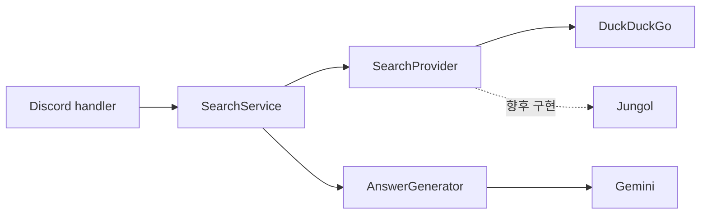

# 아키텍처

## 설계 목표

- Discord 코드는 Gemini나 특정 검색 사이트의 세부 구현을 알지 않습니다.
- 웹 검색과 Jungol 문제·태그 검색을 같은 공급자 계약으로 확장합니다.
- 테트리오·체스 등 참고 저장소의 게임 기능과 대규모 단일 파일 구조는 가져오지 않습니다.
- 실제로 수집한 URL만 공개 답변의 출처 목록에 표시합니다.

## 요청 흐름

1. `discord.js`가 `/search` interaction을 받고 사용자 속도 제한을 확인합니다.
2. `WebSearchService`가 선택된 `SearchProvider`에 구조화된 결과를 요청합니다.
3. 현재 `DuckDuckGoSearchProvider`가 제목, URL, 검색 요약을 수집합니다.
4. `GeminiAnswerGenerator`가 결과만 근거로 답변하고 `[1]` 형식의 출처 번호를 붙입니다.
5. 서비스가 실제 URL 목록을 답변 끝에 추가하고 Discord 길이에 맞춰 나눕니다.
6. 마지막 질문과 답변을 사용자·채널별로 30분 보관해 후속 질문에 사용합니다.

## 핵심 계약

- `SearchProvider`: 질문을 받아 `title`, `url`, `snippet` 목록을 반환합니다.
- `AnswerGenerator`: 질문과 검색 결과를 받아 근거가 표시된 Markdown 답변을 반환합니다.
- `SearchService`: 두 계약을 조정하고 빈 결과·출처 목록을 일관되게 처리합니다.

따라서 Jungol 기능은 `JungolSearchProvider`를 추가한 뒤 새 `/jungol` 명령에서 선택하면 됩니다. 태그 정규화, 페이지네이션, 난이도 필터는 공급자 내부의 도메인 로직으로 두고 Discord handler에는 넣지 않습니다.

## 보안과 개인정보

- Gemini 키는 `x-goog-api-key` 헤더로만 전송하고 로그에 남기지 않습니다.
- 웹 결과는 신뢰할 수 없는 데이터로 취급하며 프롬프트 명령으로 따르지 않습니다.
- 메모리에는 마지막 질문과 답변 및 만료 시각만 저장하고 재시작 시 삭제됩니다.
- Message Content privileged intent를 쓰지 않고 사용자가 실행한 슬래시 명령만 처리합니다.

## 현재 한계

DuckDuckGo HTML 결과 수집은 무료이며 별도 검색 키가 필요 없지만 공식 검색 API 계약이 아닙니다. HTML 구조나 정책이 바뀌면 공급자만 교체해야 합니다. 프로덕션 규모에서는 공식 검색 API와 캐시를 사용하는 것이 안전합니다.
