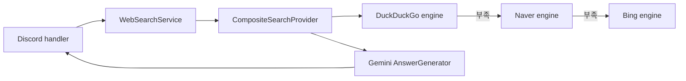

# 아키텍처

## 결정

검색 구조는 `kannyan`의 브라우저형 HTML 요청과 DOM 파싱 방식을 채택하되, 한 검색 엔진이나 하나의 거대한 파일에 의존하지 않는 합성 구조로 확장합니다. Discord, 검색 발견, 사이트 전용 스크래핑, Gemini 요약은 서로 분리합니다.

## 일반 웹검색 흐름

1. Discord handler가 `/search`를 받고 속도 제한을 확인합니다.
2. `CompositeSearchProvider`가 하나의 전체 타임아웃을 시작합니다.
3. DuckDuckGo 엔진이 브라우저형 GET 요청과 JSDOM 파싱을 수행합니다.
4. 필요한 결과 수를 채우지 못하면 Naver, Bing 엔진을 순서대로 호출합니다.
5. URL을 기준으로 중복을 제거하고 최대 결과 수까지만 Gemini에 전달합니다.
6. Gemini는 전달받은 결과만 근거로 자연스럽게 답변하되 출처 번호와 URL은 공개 응답에 표시하지 않습니다.
7. 마지막 질문과 답변은 사용자·채널별로 30분 보관합니다.



## 모듈 경계

| 계층 | 책임 |
|---|---|
| `bot` | Discord 명령, defer, 공개 메시지, 오류 응답 |
| `scraping` | 공통 브라우저 헤더, HTTP 요청, 응답 크기 제한 |
| `search/engines` | 검색 엔진별 URL 구성, 차단 감지, JSDOM 결과 파싱 |
| `CompositeSearchProvider` | 순차 fallback, 결과 보충, 중복 제거, 진단 요약 |
| `WebSearchService` | 검색 결과와 Gemini 답변 생성 조정 |
| `gemini` | 검색 결과 기반 답변 생성 |

검색 엔진이 모두 실패하면 내부 오류 메시지에 다음과 같은 진단이 남습니다.

```text
duckduckgo:blocked:http202:results0:120ms,naver:empty:http200:results0:350ms,bing:success:http200:results5:210ms
```

Discord에는 안전한 오류 코드만 보이고, 실행 로그에서는 어느 엔진이 어떤 상태였는지 확인할 수 있습니다.

## Jungol과 Naver Sports 확장

Jungol 문제·태그와 Naver Sports KBO는 일반 검색 엔진으로 구현하지 않습니다. 두 기능은 `BrowserHttpClient`만 공유하고 각각 전용 URL 빌더, JSDOM 파서, 구조화된 응답 타입을 갖는 사이트 스크래퍼로 추가합니다.

```text
BrowserHttpClient
├── 일반 검색 엔진
│   ├── DuckDuckGo
│   ├── Naver Search
│   └── Bing
└── 사이트 전용 스크래퍼
    ├── JungolProblemScraper
    └── NaverSportsKboScraper
```

이 경계를 지키면 검색 엔진 HTML 변경이 Jungol/KBO 기능을 깨뜨리지 않고, 반대 경우도 동일합니다.

## 현재 한계

HTML 검색과 웹스크래핑은 대상 사이트의 응답 구조와 접근 정책에 영향을 받습니다. 엔진별 fixture 테스트와 진단을 유지하고, 규모가 커지면 같은 인터페이스를 구현하는 공식 검색 API 공급자로 교체합니다.
