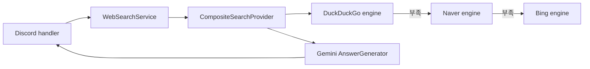

# 아키텍처

## 결정

검색 구조는 `kannyan`의 브라우저형 HTML 요청과 DOM 파싱 방식을 채택하되, 한 검색 엔진이나 하나의 거대한 파일에 의존하지 않는 합성 구조로 확장합니다. Discord, 검색 발견, 사이트 전용 스크래핑, Gemini 요약은 서로 분리합니다.

## 일반 웹검색 흐름

1. Discord handler가 `/search`를 받고 속도 제한을 확인합니다.
2. `CompositeSearchProvider`가 하나의 전체 타임아웃을 시작합니다.
3. DuckDuckGo 엔진이 브라우저형 GET 요청과 JSDOM 파싱을 수행합니다.
4. 필요한 결과 수를 채우지 못하면 Naver, Bing 엔진을 순서대로 호출합니다.
5. URL을 기준으로 중복을 제거하고 최대 결과 수까지만 Gemini에 전달합니다.
6. Gemini는 전달받은 결과만 근거로 자연스럽게 답변하되 출처 번호와 URL은 공개 응답에 표시하지 않습니다.
7. 마지막 질문과 답변은 사용자·채널별로 30분 보관합니다.



## 모듈 경계

| 계층 | 책임 |
|---|---|
| `bot` | Discord 명령, defer, 공개 메시지, 오류 응답 |
| `scraping` | 공통 브라우저 헤더, HTTP 요청, 응답 크기 제한 |
| `search/engines` | 검색 엔진별 URL 구성, 차단 감지, JSDOM 결과 파싱 |
| `CompositeSearchProvider` | 순차 fallback, 결과 보충, 중복 제거, 진단 요약 |
| `WebSearchService` | 검색 결과와 Gemini 답변 생성 조정 |
| `gemini` | 검색 결과 기반 답변 생성 |
| `kbo` | 팀명 정규화, KST 날짜 결정, Naver Sports 일정·라인업·현재 투수 정규화 |
| `jungol` | 공개 문제 요약, 태그 목록, 계정 검색 HTML 파싱 |
| `state` | 대화 메모리와 KBO 알림 중복 방지 상태 |

검색 엔진이 모두 실패하면 내부 오류 메시지에 다음과 같은 진단이 남습니다.

```text
duckduckgo:blocked:http202:results0:120ms,naver:empty:http200:results0:350ms,bing:success:http200:results5:210ms
```

Discord에는 안전한 오류 코드만 보이고, 실행 로그에서는 어느 엔진이 어떤 상태였는지 확인할 수 있습니다.

## Jungol과 Naver Sports 확장

Jungol 문제·태그와 Naver Sports KBO는 일반 검색 엔진으로 구현하지 않습니다. Jungol은 `BrowserHttpClient` 위의 HTML 파서로, KBO는 별도 `JsonHttpClient` 위의 구조화된 공급자로 구현합니다.

```text
BrowserHttpClient
├── 일반 검색 엔진
│   ├── DuckDuckGo
│   ├── Naver Search
│   └── Bing
└── 사이트 전용 스크래퍼
    └── JungolHtmlProvider

JsonHttpClient
└── NaverKboProvider
    ├── schedule/games
    ├── preview
    └── relay (라인업·현재 투수)
```

이 경계를 지키면 검색 엔진 HTML 변경이 Jungol/KBO 기능을 깨뜨리지 않고, 반대 경우도 동일합니다.

## KBO 라인업 흐름

1. `/lineup`은 입력을 10개 구단 코드와 별칭 중 하나로 정규화합니다.
2. 서버 시간대와 무관하게 `Asia/Seoul` 기준 오늘 날짜를 계산합니다.
3. 당일 KBO 일정에서 해당 팀의 경기를 찾습니다. 더블헤더면 두 경기를 모두 유지합니다.
4. 경기 전에는 `preview`의 선발투수와 발표된 타순을 읽습니다.
5. 시작·종료된 경기는 `relay`의 확정 타순과 교체 선수로 보강합니다.
6. 같은 일정과 경기 데이터는 기본 30초 동안 메모리에 보관해 반복 요청을 줄입니다.
7. Zod 검증 실패는 `KBO_INVALID_RESPONSE`, 네트워크 오류는 `KBO_UPSTREAM_FAILED`로 분리합니다.
8. Discord 응답은 경기당 임베드 카드 하나로 만들고 원정·홈 라인업을 세로 필드로 배치합니다. 더블헤더는 카드 두 장으로 분리합니다.

네이버 스포츠 게이트웨이는 공식 개발자 API가 아니므로 응답 변경 가능성을 전제로 합니다. 인증 정보나 쿠키를 사용하지 않고 공개 데이터만 낮은 빈도로 요청하며, 제공자 구현과 fixture만 교체할 수 있게 격리합니다.

## KBO 자동 알림 흐름

1. 경기 시작 1시간 전 또는 경기 중에는 기본 30초, 그 외에는 5분 간격으로 당일 일정을 확인합니다.
2. 같은 예정 시각의 경기는 하나의 `PLAYBALL` 이벤트로 묶습니다.
3. 한화 경기 중에는 relay의 `currentGameState.pitcher` 선수 코드를 실제 한화 투수 명단과 대조합니다.
4. 현재 투수가 김서현일 때만 `KIM_SEOHYUN` 이벤트를 만듭니다.
5. Discord 채널이 허용 서버 소속인지 확인하고 이름이 정확히 `야구`인 역할 하나만 멘션합니다.
6. 성공한 이벤트 키를 채널별로 `.data/kbo-alert-state.json`에 기록해 재시작 후 중복 전송을 막습니다.

알림 대상 채널이 비어 있으면 모니터를 시작하지 않습니다. 역할이 없거나 중복되면 임의로 고르지 않고 해당 알림을 실패 처리해 로그에 남깁니다.

## Jungol 공개 검색 흐름

1. `/problem`은 공개 문제 페이지의 Open Graph 제목·난이도·통계와 제한·태그만 읽습니다.
2. `/tag`는 공개 문제 목록의 정확한 문제 링크를 중복 제거해 최대 10개 반환합니다.
3. `/user`는 공개 검색 페이지의 계정 링크를 최대 5개 반환하고 정확한 핸들 일치를 우선합니다.
4. 기본 5분 캐시, 10초 타임아웃, 3MB 응답 제한을 적용합니다.
5. 문제 본문·예제·풀이·제출 코드·로그인 쿠키는 수집하지 않습니다.

## 현재 한계

HTML 검색과 웹스크래핑은 대상 사이트의 응답 구조와 접근 정책에 영향을 받습니다. 엔진별 fixture 테스트와 진단을 유지하고, 규모가 커지면 같은 인터페이스를 구현하는 공식 검색 API 공급자로 교체합니다.
